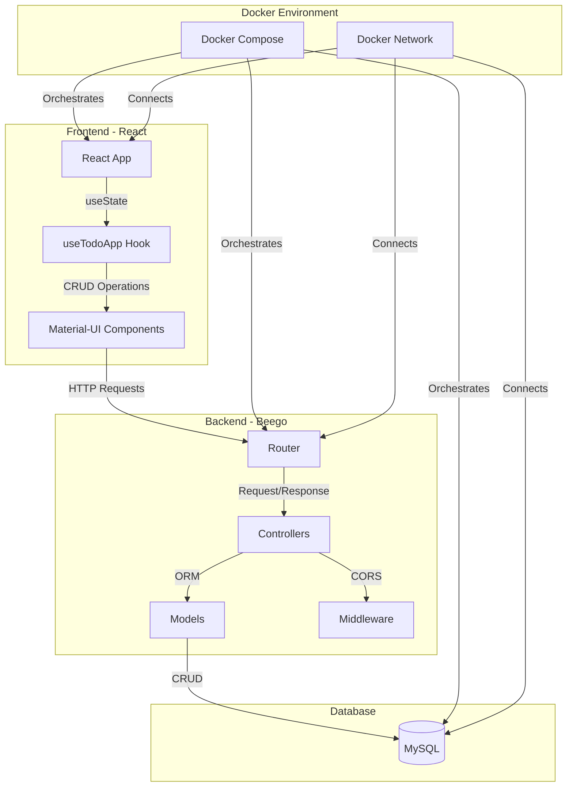
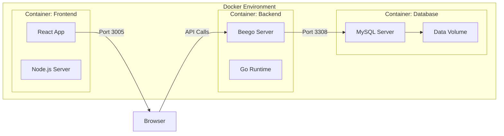

# Full Stack Todo Application

A modern todo list application built with React (Frontend), Beego (Backend), and MySQL (Database), all containerized with Docker.

## Project Structure

```
.
├── beego/                  # Backend
│   ├── conf/              # Configuration files
│   │   └── app.conf      
│   ├── controllers/       # API Controllers
│   │   ├── base.go       # Base controller with CORS
│   │   └── todo.go       # Todo CRUD operations
│   ├── database/         # Database configuration
│   │   └── mysql.go
│   ├── models/           # Data models
│   │   └── todo.go
│   ├── routers/          # URL routing
│   │   └── router.go
│   ├── Dockerfile        # Backend container config
│   └── main.go           # Entry point
├── client/               # Frontend
│   ├── src/
│   │   ├── App.tsx       # Main React component
│   │   ├── useTodoApp.tsx # Custom hook for todo logic
│   │   └── index.tsx
│   ├── Dockerfile        # Frontend container config
│   └── package.json
└── docker-compose.yml    # Multi-container orchestration
```

## Features

- **Frontend**:
  - Material-UI components for modern UI
  - Real-time todo updates
  - Complete CRUD operations
  - TypeScript for type safety

- **Backend**:
  - RESTful API with Beego framework
  - MySQL database integration
  - CORS support
  - Containerized deployment

## Prerequisites

- Docker
- Docker Compose
- Node.js (for local development)
- Go (for local development)

## Quick Start

1. Clone the repository:
```bash
git clone <repository-url>
cd <repository-name>
```

2. Create `.env` file in the root directory:
```env
MYSQL_ROOT_PASSWORD=rootpass
MYSQL_DATABASE=tododb
MYSQL_USER=todouser
MYSQL_PASSWORD=todopass
```

3. Start the application:
```bash
docker-compose up --build
```

The application will be available at:
- Frontend: http://localhost:3005
- Backend API: http://localhost:8080
- MySQL: localhost:3308

## API Endpoints

| Method | Endpoint | Description |
|--------|----------|-------------|
| GET | /api/todos | Get all todos |
| GET | /api/todos/:id | Get a specific todo |
| POST | /api/todos | Create a new todo |
| PUT | /api/todos/:id | Update a todo |
| DELETE | /api/todos/:id | Delete a todo |

## Development

### Frontend (React)

```bash
cd client
npm install
npm start
```

### Backend (Beego)

```bash
cd beego
go mod tidy
go run main.go
```

## Latest Changes

- Added CORS support for cross-origin requests
- Implemented complete CRUD operations
- Added MySQL database integration
- Created custom React hook for todo management
- Added Material-UI components
- Containerized the entire application

## Contributing

1. Fork the repository
2. Create your feature branch (`git checkout -b feature/AmazingFeature`)
3. Commit your changes (`git commit -m 'Add some AmazingFeature'`)
4. Push to the branch (`git push origin feature/AmazingFeature`)
5. Open a Pull Request


## Architecture

### System Architecture

이 다이어그램은 애플리케이션의 주요 컴포넌트와 그들 간의 관계를 보여줍니다.

### Data Flow
```
sequenceDiagram
    participant User
    participant React
    participant Beego
    participant MySQL

    User->>React: Interact with UI
    React->>Beego: API Request
    Note over React,Beego: HTTP with CORS
    Beego->>MySQL: Query Data
    MySQL-->>Beego: Return Results
    Beego-->>React: JSON Response
    React-->>User: Update UI
```
사용자 상호작용부터 데이터베이스 작업까지의 데이터 흐름을 보여줍니다.

### Deployment Architecture

Docker 컨테이너화된 환경에서의 배포 구조를 보여줍니다.

Key Components:
- **Frontend Container**: React 애플리케이션 (포트 3005)
- **Backend Container**: Beego 서버 (포트 8080)
- **Database Container**: MySQL 서버 (포트 3308)

## License

This project is licensed under the MIT License - see the LICENSE file for details.
